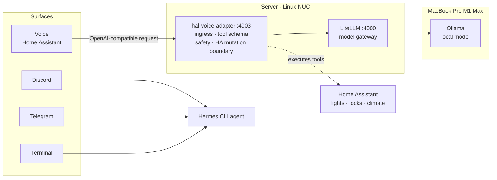
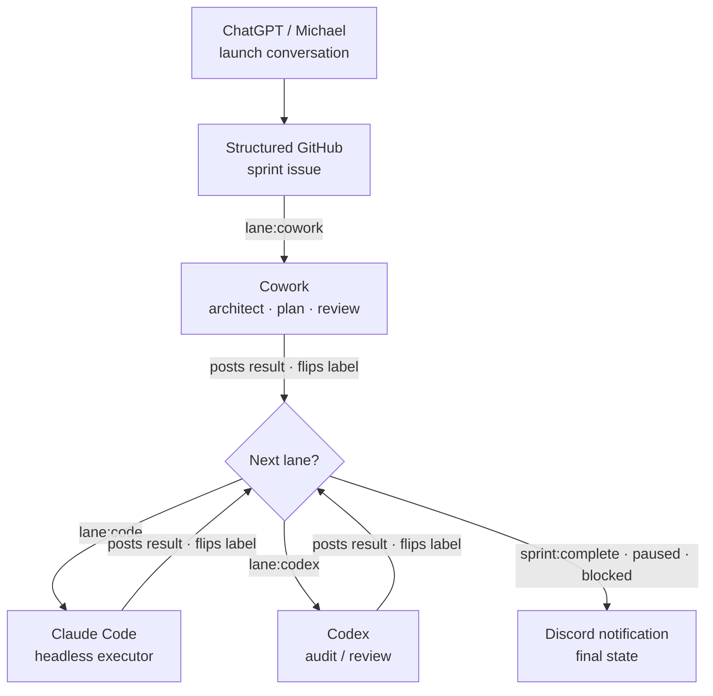

# HAL AI Assistant

HAL is a local-first personal AI assistant and multi-agent coordination system. The project explores how a private household AI assistant can combine memory, task tracking, automation, voice interfaces, and human-approved agent workflows without turning every interaction into a cloud-only black box.

This public repository is a recruiter-facing portfolio snapshot. The private development repository includes additional operational details, local configuration, machine-specific notes, and coordination history that are intentionally excluded from this public copy.

## Project summary

HAL has two related but distinct goals:

1. Build a useful personal AI assistant that can remember, summarize, track commitments, prepare briefings, and draft actions for approval.
2. Build an orchestration layer that lets multiple AI tools collaborate through structured GitHub issues, pull requests, review gates, and handoff rules.

The guiding principle is simple:

> HAL is the product. The orchestrator is the build machine.

The orchestrator is valuable only when it reduces manual handoffs and improves the reliability of building HAL.

## Current portfolio focus

This public snapshot emphasizes the system design and engineering approach rather than private runtime configuration.

Key areas represented:

- Local-first AI assistant architecture
- Privacy and security guardrails
- Human-in-the-loop approval boundaries
- GitHub-centered project state management
- Multi-agent coordination patterns
- Review gates and acceptance criteria
- Discord/GitHub relay concepts
- Skill registry and structured prompt tooling
- Roadmap-driven development

## Architecture overview

HAL is designed around a few core surfaces:

| Layer | Purpose |
|---|---|
| Assistant layer | User-facing AI behavior, memory, planning, summaries, and drafting |
| Orchestrator layer | Coordinates AI work across planning, coding, review, and handoff lanes |
| Canonical state | GitHub issues, pull requests, labels, and tracked decisions |
| Notification surface | Status updates and escalation messages |
| Local services | Self-hosted model gateways, automation services, and household integrations |
| Guardrails | Explicit boundaries for privacy, memory, mutation, and external communication |

The two diagrams below show the split: the runtime (the product) and the build orchestration (the machine that builds it).

### Runtime: voice in, local inference, safe action out

### Build: four AI agents coordinated through a GitHub state machine

## Design principles

- Local-first where practical
- No silent long-term memory writes
- Human approval before meaningful external action
- GitHub is canonical project state
- Chat and notification surfaces are not source of truth
- Agent autonomy must be bounded by stop conditions, usage limits, and review gates
- Reliability beats novelty
- Public portfolio code excludes credentials, local paths, operational secrets, and household-specific details

## Representative capabilities

Planned or partially implemented capabilities include:

- Daily and project status briefings
- Commitment and follow-up tracking
- Decision compression from long GitHub threads
- Pull request preflight review patterns
- Architect/code/review lane handoffs
- Skill registry and output evaluation harnesses
- Local assistant memory review queue
- Home Assistant and voice interface planning
- Media and home-lab assistant extensions

## Why this matters

This project demonstrates practical systems thinking across product design, automation, risk controls, and AI-assisted software development. The core challenge is not simply connecting tools together. The challenge is designing a system that remains useful, inspectable, and safe as more autonomy is added.

## Repository status

This repository is currently a public portfolio snapshot, not the full private working tree.

Excluded from this public version:

- Secrets, tokens, webhooks, and credentials
- Local machine configuration
- Private household details
- Private issue and pull request discussions
- Operational routing details
- Any material not suitable for a recruiter-facing portfolio

## Documentation map

| File | Purpose |
|---|---|
| `docs/architecture-overview.md` | High-level system architecture |
| `docs/orchestration-model.md` | Multi-agent workflow and lane model |
| `docs/coordination-skills/` | Sanitized coordination-skill examples for sprint kickoff, handoff discipline, and architect re-entry |
| `docs/security-guardrails.md` | Safety, privacy, and approval boundaries |
| `docs/roadmap.md` | Public roadmap and staged build plan |
| `docs/portfolio-notes.md` | Notes on what this public copy represents |
| `docs/selected-engineering-decisions.md` | The strongest decisions + the safety subsystem, for a quick read |
| `docs/case-study-orchestrator.md` | Why the build system moved off GUI automation |
| `decisions/` | Full Architecture Decision Record set (ADR-001 … ADR-008) |
| `machines/server/hal-voice-adapter/confirm/` | The confirm-before-mutate safety subsystem (code + tests) |

## License

Source-available for review and portfolio purposes. All rights reserved. Not licensed for reuse or redistribution.